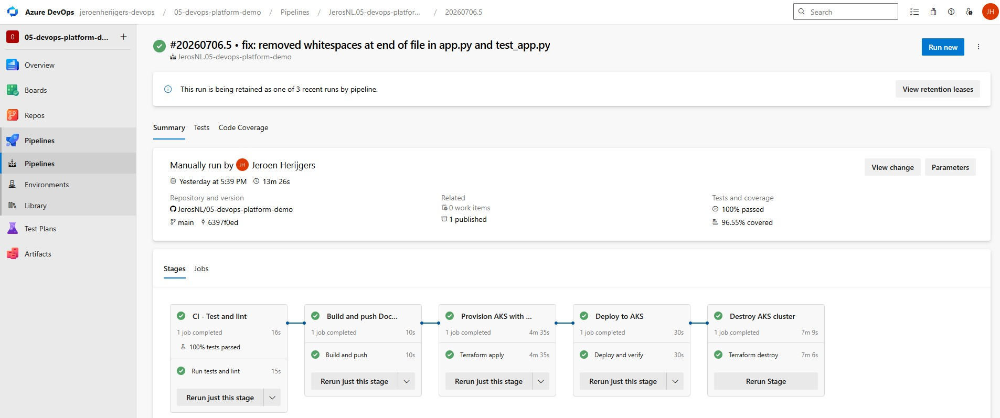
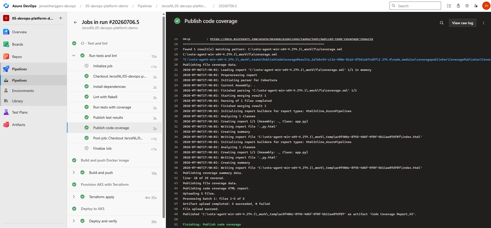
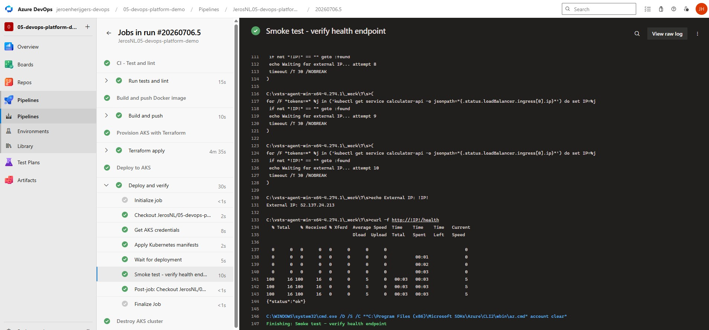

# DevOps Platform Demo

## What this is

A Python Flask web API deployed to Azure Kubernetes Service through a fully automated Azure DevOps pipeline. This is my fifth and final portfolio project, combining everything from the previous four projects into a single end-to-end DevOps platform.

## What the pipeline does

```
CI (lint and test) -> Build and push Docker image -> Provision AKS -> Deploy to AKS -> Smoke test -> Destroy
```

The pipeline enforces quality gates — the Docker image is only built if lint and tests pass. The cluster is provisioned only if the image was successfully pushed. The smoke test hits the live application over HTTP to verify it is genuinely reachable before the cluster is destroyed.

## Pipeline stages

**CI** - flake8 checks code style and pytest runs six unit tests with coverage reporting. The pipeline fails here if any test fails or any lint violation is found.

**Build** - Docker builds the Flask API image with tests running inside the build, then pushes to GitHub Container Registry with a unique build ID tag and a latest tag.

**Provision** - Terraform provisions a resource group and AKS cluster in Azure West Europe. State is stored remotely in Azure Blob Storage.

**Deploy** - kubectl applies the Kubernetes manifests and waits for the pod to reach a running state.

**Smoke test** - the pipeline retrieves the external IP from the Azure Load Balancer and hits the `/health` endpoint with curl. A successful response proves the application is reachable over the internet.

**Destroy** - Terraform destroys all resources using `condition: always()` so the cluster is cleaned up even if earlier stages fail.

## The application

A Flask web API exposing calculator operations over HTTP:

```
GET /health          returns {"status": "ok"}
GET /add?a=2&b=3     returns {"result": 5.0}
GET /subtract?a=10&b=3  returns {"result": 7.0}
GET /multiply?a=4&b=5   returns {"result": 20.0}
GET /divide?a=10&b=2    returns {"result": 5.0}
```

## What I learned

- A real CI gate means the build stage never runs if tests fail, which prevents pushing broken images to the registry
- Smoke testing against a live endpoint is more valuable than just checking the pod is running, it proves the full stack is working end to end
- The smoke test needs to wait for the Azure Load Balancer to assign a public IP before it can reach the application, this takes a minute or two after the Service is created
- Combining Terraform, Docker and Kubernetes in a single pipeline requires careful ordering of stages and clear dependencies between them
- `condition: always()` on the Destroy stage is essential in a pipeline that provisions real infrastructure, otherwise a failure leaves resources running and accumulating cost

## Tech used

- Python, Flask, pytest, flake8
- Docker
- GitHub Container Registry (ghcr.io)
- Terraform
- Azure Kubernetes Service (AKS)
- kubectl
- Azure DevOps Pipelines
- Self-hosted Windows agent

## Project structure

```
src/                Flask web API
tests/              pytest unit tests
terraform/          AKS cluster provisioning
k8s/                Kubernetes manifests
Dockerfile          Container image definition
azure-pipelines.yml Pipeline definition
```

## Screenshots



